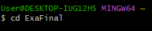

# Proyecto final
#### integrantes:
#### Nicolas Carreño Tascon
#### Cristian Aristizabal Figueroa
#### avid Hernandez
#### Santiago Figueroa Soto
#
### Si el archivo no se le ven las imagenes es porque se debe ejecutar en la carpeta en la que venía, ahi es donde estan las imagenes
## Paso a paso de los codigos:

## Explicación del codigo en Python:

Así unimos los 2 archivos y sus respectivas funciones llamadas

Se le pregunta al usuario que función desea ejecutar

si se elige la opción 1 se pregunta solo por 1 carácter y se envía ese dato a la función que esta en el otro archivo de las operaciones.

Esta es la función que se llama para solo 1 carácter, lo que se hace es con ayuda de el ord conseguir el valor numerico ASCII de el carácter y después transformarlo a binario haciendo uso del comando format.
Por ultimo para la opción 1, se imprime se una forma en la cual muestra que carácter era, cual era su código ASCII y su forma en binario.

Si la respuesta es la opción 2 entonces se pedirá la palabra y ese dato se enviara al momento de llamar a la respectiva función que está en el otro archivo de las operaciones.

Esta es la función de cuando se quiere conocer el binario pero de una palabra, esta es muy parecida a la de un solo carácter, lo único que cambia es que la palabra que se recogió de el menú la volveremos una lista y así podremos hacer un for loop que usara una variable x que recorrerá cada letra de la palabra y agregara su binario a una nueva lista que estará en el mismo orden de la palabra solo que en vez de haber letras habrán sus formas en binario. Al final se retornan esta nueva lista y la palabra pero en modo de lista.
Finalmente se hace print del mismo modo como se hizo en el de un solo carácter solo que ahora se repetirá las veces de letras que tenga la palabra haciendo uso de un for loop. Ya para finalizar se escribe en un mismo renglon la lista con la palabra en binario asiendo uso del comando join.

## explicación del codigo en Bash:

Establece el nombre que quieres adjuntar a tus transacciones de commit

Establece el email que quieres adjuntar a tus transacciones de commit

Clona un repositorio que ya existe en GitHub, incluyendo todos los archivos, ramas y confirmaciones.

cd exaFinal lo usamos para movernos en los archivos de nuestro computador

funciona para crear una rama

funciona para cambiarte de una rama a otra

funciona para brindar información necesaria sobre la rama actual en la que estamos trabajando y ademas con el add se agrega el archivo correspondiente

permite incluir  los cambios en los archivos modificados en tu siguiente  commit

establece un punto de control de los cambios y los almacena de forma remota

$ git config --global usuario.nombre "[nombre]"
Establece el nombre que quieres adjuntar a tus transacciones de commit

$ git config --global user.email "[dirección de correo electrónico]"
Establece el email que quieres adjuntar a tus transacciones de commit

$git clone Clonar (descargar) un repositorio que ya existe en
GitHub, incluyendo todos los archivos, ramas y confirmaciones

cd exaFinal lo usamos para movernos en los archivos de nuestro computador

$git branch <branchname> funciona para crear una rama

$git checkout <branchname> funciona para cambiarte de una rama a otra

$git status funciona para brindar información necesaria sobre la rama actual en la que estamos trabajando

$git add  permite incluir  los cambios en los archivos modificados en tu siguiente  commit

$git commit -m "message"  establece un punto de control de los cambios y los almacena de forma local

$git push origin es para actualizar los cambios en el repositorio remoto